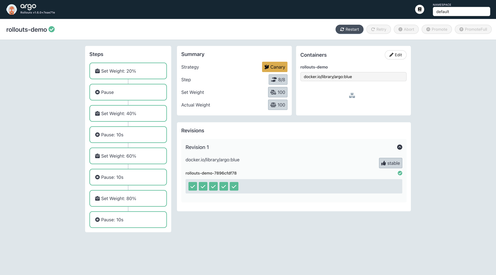
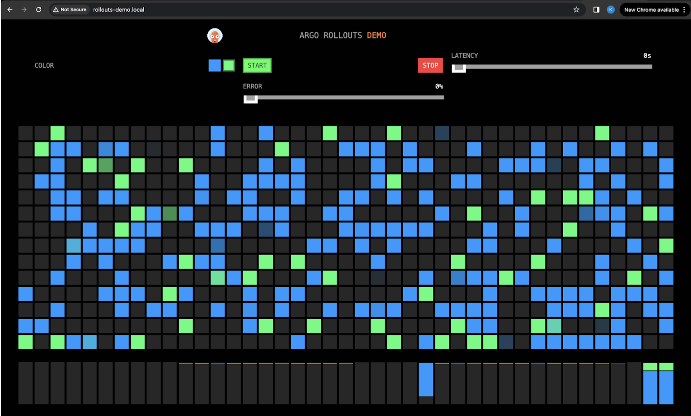
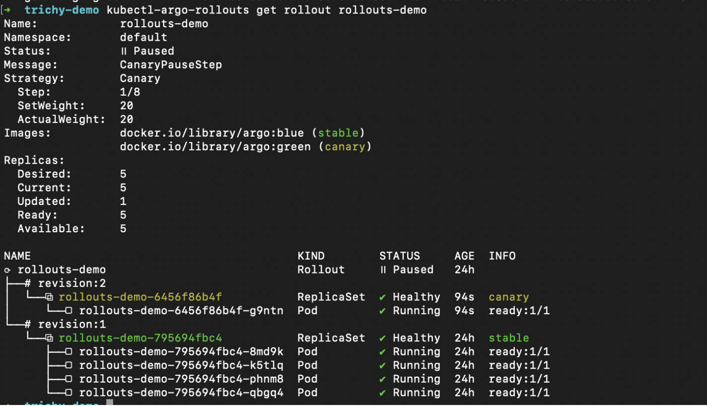

# ci-cd-workshop
anomaly detection using numaflow

## Installation

The following steps are to install the anomaly detection pipeline in your Kubernetes cluster and run it to show how it works.

### Prerequisites

- `kubectl` CLI
- `k3d` CLI
- `docker` CLI
- `helm` CLI
- Docker Engine

### Installation Steps

1. Creating a local Kubernetes cluster using k3d

```bash
k3d cluster create ci-cd-workshop-cluster --api-port 6550 -p "8081:80@loadbalancer" --agents 2
```

2. Installing Prometheus Operator using helm

```bash
helm install --wait --timeout 15m \
   --repo https://prometheus-community.github.io/helm-charts \
   kube-prometheus-stack kube-prometheus-stack --values - <<EOF
prometheus:
    prometheusSpec:
        remoteWrite:
            - queueConfig:
                batchSendDeadline: 10s
                capacity: 10000
                maxBackoff: 100ms
                maxSamplesPerSend: 1000
                maxShards: 100
                minBackoff: 30ms
                minShards: 10
              url: http://promkafkawriter-metrics:8080/receive
EOF
```

3. Create ArgoCD namespace and install ArgoCD to the cluster

```bash
kubectl create namespace argocd
kubectl apply -n argocd -f https://raw.githubusercontent.com/argoproj/argo-cd/stable/manifests/install.yaml
```

4. Deploying a Flask application to emit metrics

```bash
kubectl apply -f metrics-app/manifests/deployment.yaml
kubectl apply -f metrics-app/manifests/service.yaml
kubectl apply -f metrics-app/manifests/serviceMonitor.yaml
```

5. Emit metrics from the Flask application

```bash
kubectl port-forward svc/flask-service 5001
```
Open the browser "http://localhost:5001/", try hitting the `/url1` and `/url2` routes to generate metrics for respective routes.


6. Install Kafka locally

```bash
kubectl apply -f anomaly-pl/manifests/minimal-kafka.yaml
```

7. Deploying an application to write metrics from Prometheus to Kafka

```bash
kubectl apply -f prom-kafka-writer/manifests/config.yaml
kubectl apply -f prom-kafka-writer/manifests/deployment.yaml
kubectl apply -f prom-kafka-writer/manifests/service.yaml
```

8. Install Numaflow

```bash
kubectl create ns numaflow-system
kubectl apply -n numaflow-system -f https://raw.githubusercontent.com/numaproj/numaflow/stable/config/install.yaml
kubectl apply -f https://raw.githubusercontent.com/numaproj/numaflow/stable/examples/0-isbsvc-jetstream.yaml
```

9. Create the anomaly detection pipeline using Numaflow

```bash
kubectl apply -f anomaly-pl/manifests/pipeline.yaml
```

10. View the pipeline

```bash
kubectl port-forward svc/numaflow-server 8443 -n numaflow-system
```

Open the browser "https://localhost:8443/", then go to Numaflow UI, select `default` namespace, and click the `anomaly-detection-pl` pipeline.


## Argo Rollouts

### Installing Argo Rollouts in your cluster

1. Create a new namespace named argo-rollouts and install the Argo Rollout CRDs (Custom Resource Defintions):
    ```bash
    kubectl create namespace argo-rollouts
    kubectl apply -n argo-rollouts -f https://github.com/argoproj/argo-rollouts/releases/latest/download/install.yaml
    ```

### Creating the Rollout and its accompanying components

1. Create a file named rollouts-demo.yaml with the following content:
    ```bash
    apiVersion: argoproj.io/v1alpha1
    kind: Rollout
    metadata:
      name: rollouts-demo
    spec:
      replicas: 1
      strategy:
        canary:
          canaryService: rollouts-demo-canary
          stableService: rollouts-demo-stable
          trafficRouting:
            nginx:
              stableIngress: rollouts-demo-stable
          steps:
          - setWeight: 5
          - pause: {}
      revisionHistoryLimit: 2
      selector:
        matchLabels:
          app: rollouts-demo
      template:
        metadata:
          labels:
            app: rollouts-demo
        spec:
          containers:
          - name: rollouts-demo
            image: argoproj/rollouts-demo:blue
            ports:
            - name: http
              containerPort: 8080
              protocol: TCP
            resources:
              requests:
                memory: 32Mi
                cpu: 5m
    ```

2. Create the above defined rollout:
    ```bash
   kubectl apply -f rollouts-demo.yaml -n argo-rollouts
    ```
   
3. Create the canary and stable services:
    ```bash
   kubectl apply -f https://raw.githubusercontent.com/argoproj/argo-rollouts/master/docs/getting-started/nginx/services.yaml -n argo-rollouts
    ```

### Installing Ingress

1. Create a deployment and service for nginx
    ```bash
    kubectl create deployment nginx --image=nginx -n argo-rollouts
    kubectl create service clusterip nginx --tcp=80:80 -n argo-rollouts
    ```

2. Create a file called rollouts_ingress.yaml with the following content:
    ```bash
    apiVersion: networking.k8s.io/v1
    kind: Ingress
    metadata:
    name: nginx
    annotations:
    ingress.kubernetes.io/ssl-redirect: "false"
    spec:
    rules:
    - http:
      paths:
        - path: /
          pathType: Prefix
          backend:
          service:
          name: rollouts-demo-stable
          port:
          number: 80
   ```

3. Create the ingress resource
    ```
   kubectl apply -f rollouts_ingress.yaml -n argo-rollouts
   ```

4. Open https://localhost:8081/ in your browser to access


### Rolling out 

1. Run the command to get the link to the argo-rollouts dashboard
    ```
   kubectl-argo-rollouts dashboard
   ```
   
2. Navigate to the rollout named rollouts-demo (as we created earlier). We can see all the steps that we had earlier defined.

3. Change the image name from argoproj/rollouts-demo:**blue** to argoproj/rollouts-demo:**green**

    
    We can see the steps getting executed in the left panel

    
    We can also see the traffic moving from blue to green

    
    We can also see the status of the rollout in the terminal

4. Now click promote in the top right corner of the rollouts dashboard

5. We can now see the rest of the steps getting executed
